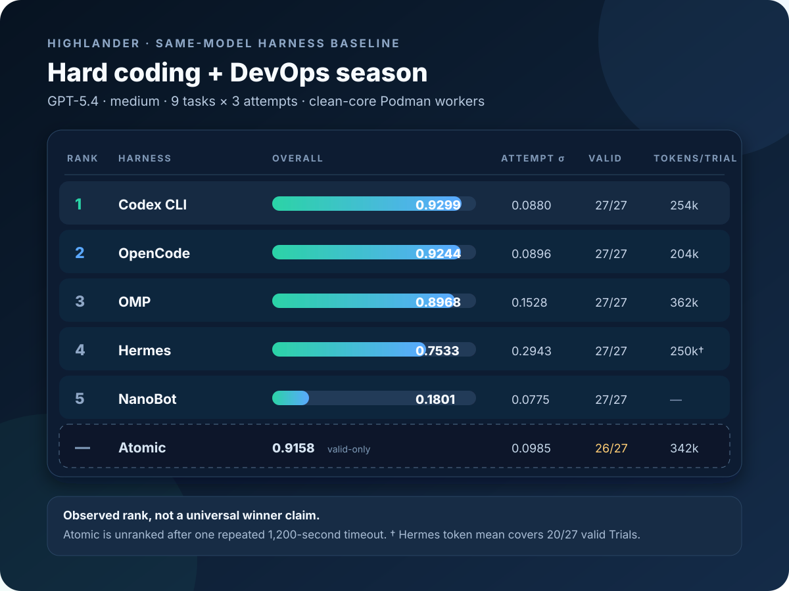

# Highlander

## There can be only one.

Highlander is a reproducible local acceptance lab for measuring how AI coding harnesses affect the work produced by the same underlying model. It evaluates correct, maintainable changes that survive deterministic checks while retaining the control, operator-attention, recovery, and cleanup evidence needed to trust the result.

This is a harness experiment, not a model leaderboard. In the primary lane, every contender receives the same task, repository snapshot, exact model, acceptance tests, and safety boundaries. The harness is the experimental variable; its tools, memory, permissions, orchestration, prompt handling, and recovery behavior are recorded alongside the resulting artifacts.

## Results

The primary public baseline holds the configured GPT-5.4 route, medium reasoning, nine unchanged
official HarnessBench coding/DevOps tasks, three attempts, evaluator bytes,
limits, permissions, and disposable clean-core configuration fixed. Only the
harness changes. Personal plugins, extensions, rules, memory, MCP servers, and
operator steering are absent.



| Rank | Harness | Overall outcome | Attempt σ | Current valid slots |
|---:|---|---:|---:|---:|
| 1 | Codex CLI 0.147.0 | 0.9299 | 0.0880 | 27/27 |
| 2 | OpenCode 1.18.15 | 0.9244 | 0.0896 | 27/27 |
| 3 | OMP 17.2.10 | 0.8968 | 0.1528 | 27/27 |
| 4 | Hermes 0.20.0 | 0.7533 | 0.2943 | 27/27 |
| 5 | NanoBot 0.1.5.post3 | 0.1801 | 0.0775 | 27/27 |
| — | Atomic 0.9.15 | 0.9158 valid-only | 0.0985 | 26/27; unranked |

This is an observed baseline, not a universal harness winner claim. Codex's
0.0055 lead over OpenCode is smaller than either harness's run-to-run
dispersion. OMP remains competitive, but one valid 0.262 migration result makes
its typical outcome less stable. Atomic produced a strong valid-only aggregate,
but its first CLI-parser attempt reached the frozen 1,200-second limit twice;
that slot is retained as invalid, never changed to zero, and Atomic is not
ranked. NanoBot is the version-pinned historical temporal proxy, not an exact
recreation of the original HarnessBench environment.

The [full GPT-5.4 leaderboard](results/hb-devhard-hardcore-v1-gpt-5.4-medium-r1/leaderboard.md)
contains every task mean and attempt range. The public bundle also retains all
200 ledger rows—162 original slots and 38 explicitly linked infrastructure
replacement attempts—plus native transcripts, tool ledgers, diffs, final
workspaces, evaluator output, usage observations, cleanup proof, and 6,090
manifested artifacts. Five harnesses are complete; the latest fixed matrix is
161 valid slots and one Atomic timeout, with zero operator interventions.

### Efficiency observations

Native token and cost fields are preserved per Trial but are not folded into
correctness. Different harnesses count cached context and calls differently, so
these values are useful within a harness and directional across harnesses, not
provider-grade billing comparisons.

| Harness | Mean native tokens / valid Trial | Token coverage | Native cost signal / Trial |
|---|---:|---:|---:|
| Codex CLI | 254,056 | 27/27 | unavailable |
| OpenCode | 204,098 | 27/27 | `$0` subscription field; not a cost claim |
| OMP | 361,778 | 27/27 | `$0.269` harness estimate |
| Hermes | 249,679 | 20/27 numeric | included/no cost source |
| NanoBot | unavailable | 0/27 | unavailable |
| Atomic | 341,570 | 26/26 valid | `$0.245` harness estimate |

The separate [GPT-5.6 Luna successor season](results/hb-devhard-hardcore-v1-gpt-5.6-luna-medium-r4/leaderboard.md)
uses the same task matrix but remains its own temporal/model stratum: OMP
0.9026, Hermes 0.8960, OpenCode 0.8941, NanoBot 0.2673, and Codex 0.1801 were
complete; Atomic was 13/27 and unranked. Do not pool those scores with GPT-5.4
or read the cross-season delta as a model-quality measurement because the runs
occurred at different times and provider-wire identity was not exposed by every
harness.

Reproduce or verify the seasons with the [runbook](docs/SEASON-RUNBOOK.md):

```text
python3 tools/hb-evidence.py verify-season \
  results/hb-devhard-hardcore-v1-gpt-5.4-medium-r1
python3 tools/hb-evidence.py verify-season \
  results/hb-devhard-hardcore-v1-gpt-5.6-luna-medium-r4
```

The earlier [task-043 repeated pilot](results/hb-devhard-043-gpt54-medium-host4-r1/report.md)
and [T002 quota-free protocol bundle](results/fake-t002-protocol-r1/README.md)
remain as calibration and protocol evidence. Neither supersedes the complete
nine-task baseline above.

## Software factory

| Tool | Use |
|---|---|
| Ghostty | Fast cross-platform terminal interface |
| Herdr | Start, arrange, and monitor concurrent terminal agent sessions |
| OMP (Oh My Pi) | Daily coding harness and multi-project control |
| Codex, Claude Code, OpenCode, Hermes, Atomic | Coding-agent runtimes used directly or compared as Highlander contenders |
| Podman | Disposable Linux containers and authentication-isolated harness homes |
| Highlander | Same-model harness scheduling, evidence capture, scoring, and comparison |
| HarnessBench | Frozen coding tasks and deterministic evaluators |
| pre-commit | Fast local repository gate before a commit or PR |
| act | Offline execution of the GitHub Actions workflow through Podman |
| Git and GitHub | Branch, review, retained evidence, and pull-request history |

## Design principles

- Same task, same base SHA, same exact model, and comparable limits in the primary harness-controlled lane.
- Never interpret a model change as a harness win. If a contender cannot run the fixed model, record it as a separate subscription-realism result.
- Separate harness-controlled results from subscription-realism results.
- Score retained evidence, not agent self-report.
- Publish the model and harness metadata together so readers can attribute output differences to the available environment.
- A false green is worse than a slow failure.
- No merge, deploy, production credentials, or branch-rule changes.
- Run DevOps and SCADA/MES matches only in disposable, simulated, or read-only environments.
- Keep a run private until its protocol, evidence, privacy, and local workflow
  gates pass; publish complete reproducible results with their limitations.
- Desktop applications are excluded from the primary lane. A stack must prove CLI, macOS/Linux/WSL, Herdr, legitimate subscription routes, and phone observe/respond capability before it can displace the control.

## Quick start

Inspect the deterministic fake Match without changing anything:

```text
python3 tools/highlander.py doctor examples/matches/fake-t001.json
python3 tools/highlander.py run examples/matches/fake-t001.json
```

Inspect the exact zero-cost T002 protocol Match retained above:

```text
python3 tools/highlander.py doctor examples/matches/fake-t002-protocol-r1.json
python3 tools/highlander.py run examples/matches/fake-t002-protocol-r1.json
```

`run` is a dry-run unless `--execute` is present. The plan records one base SHA, the exact Task hash, worktree and evidence paths, adapter versions, model controls, and redacted invocations. It does not create worktrees or panes and cannot make a model call.

Execute two quota-free fake Contenders headlessly or in one detached tmux window:

```text
python3 tools/highlander.py run examples/matches/fake-t001.json \
  --save-plan /tmp/highlander-fake-plan.json
python3 tools/highlander.py run examples/matches/fake-t001.json \
  --plan /tmp/highlander-fake-plan.json --execute
python3 tools/highlander.py run examples/matches/fake-t001.json \
  --session tmux --save-plan /tmp/highlander-fake-tmux-plan.json
python3 tools/highlander.py run examples/matches/fake-t001.json \
  --session tmux --plan /tmp/highlander-fake-tmux-plan.json --execute
```

Change `match_id` before repeating an executed Match. Match directories and worktrees are retained intentionally for audit. The pilot does not delete them automatically.

Inspect the planned OMP-versus-OpenCode low-reasoning command crosswalk:

```text
python3 tools/highlander.py doctor \
  examples/matches/omp-opencode-low-reasoning.json
python3 tools/highlander.py run \
  examples/matches/omp-opencode-low-reasoning.json
```

Real Harness Adapters are deliberately blocked from host execution. Highlander never changes the normal Harness installation, authentication, Herdr integrations, or model selection.

Digest-pinned OMP, OpenCode, Codex, Hermes, Atomic, and NanoBot execution is available through the disposable OCI clean room. It creates independent clones with no publication remote, starts each Harness without host configuration, evaluates the raw result, captures tracked and untracked changes, and destroys Trial state. See [docs/CLEAN-ROOM.md](docs/CLEAN-ROOM.md) for image build, clean login seeds, Match generation, and execution. Ordinary MatchRunner host execution remains blocked. The separately labeled `tools/hb-pilot.py` path exists only for a frozen, dedicated-profile subscription-realism protocol when clean-room auth is explicitly recorded as unavailable.

Authentication is a one-time setup per harness and computer, not a login before
every Trial. Each clean-room OAuth seed persists outside the repository under
`~/.config/highlander/seeds` and supplies only the harness's credential file to
each disposable home. Personal plugins, extensions, skills, rules, MCP servers,
memory, and ordinary harness configuration are not imported. Reauthenticate
only when the provider revokes or expires that dedicated grant; never commit or
cloud-sync the seed directory. The six setup commands and exact imported files
are documented in [docs/CLEAN-ROOM.md](docs/CLEAN-ROOM.md#one-time-host-setup).

The original `tools/prepare-run.sh` remains available as a legacy worktree-only preparer while MatchRunner matures.

Score a completed legacy pilot run after collecting the evidence bundle:

```text
python3 tools/score-run.py --scorecard path/to/scorecard.json
```

The first HarnessBench-aligned coding/DevOps season is frozen in
`benchmark-packs/hb-devhard-v1.json`. Its outcome leaderboard is intentionally
separate from the legacy weighted scorecard:

```text
python3 tools/hb-leaderboard.py \
  --manifest benchmark-packs/hb-devhard-v1.json \
  --results results/hb-devhard-v1/results.jsonl
```

The next hard-first extension is frozen separately in
`benchmark-packs/hb-devhard-hardcore-v1-r4.json`. It runs nine unchanged official
tasks three times each for OMP, OpenCode, Codex, Hermes, Atomic, and NanoBot.
Generate its provisional per-task matrix before any paid run:

```text
python3 tools/hb-leaderboard.py \
  --manifest benchmark-packs/hb-devhard-hardcore-v1-r4.json \
  --results /dev/null
```

See [docs/LEADERBOARD.md](docs/LEADERBOARD.md) for the typical-outcome,
best-attempt, per-task, reliability, invalid-run, and ranking contract.

The first retained real pilot covers official HarnessBench task 043 with three
GPT-5.4/medium repeats each for OMP, OpenCode, Codex, and Hermes. It is a
single-task host-isolated baseline, not a winner claim:

```text
python3 tools/hb-evidence.py verify \
  results/hb-devhard-043-gpt54-medium-host4-r1
```

Run the complete pre-commit gate:

```text
pre-commit install
pre-commit run --all-files --verbose
```

Run the same GitHub Actions workflow locally through Podman without consuming
hosted Actions minutes or fetching workflow actions during execution:

```text
podman machine start
tools/run-act-local.sh
```

The standard `catthehacker/ubuntu:act-latest` runner image and the pinned
workflow actions must already be cached; offline mode fails closed instead of
downloading missing dependencies. The hosted workflow pins Python 3.11;
network-disabled `act` uses the runner image's preinstalled Python 3.12 and
asserts that the repository's Python 3.11 minimum is satisfied.
The retained output from the first accepted local gate is under
[`validation/local-gates/2026-08-21`](validation/local-gates/2026-08-21/README.md).

## Match lifecycle

1. Calibrate the visible task and evaluator-only checks.
2. Freeze the target repository at an exact commit.
3. Prepare one isolated worktree per contender.
4. Paste the same task packet into each harness.
5. Preserve transcripts, tool events, diffs, tests, review, CI, cleanup, and operator interactions.
6. Score hard gates first, then the weighted result.
7. Store one result directory per harness, then publish only a redacted comparison report when the task and rubric are trusted.

## Repository map

- `docs/GAUNTLET.md` — rules, scoring, evidence, and benchmark-design guidance.
- `docs/MOBILE-SUPERVISION.md` — phone monitoring/responding protocol and control-plane ablations.
- `docs/MATCH-RUNNER.md` — pilot CLI, state machine, adapter boundary, and tmux workflow.
- `docs/CLEAN-ROOM.md` — pinned images, authentication seeds, disposable clones, raw evaluation, and cleanup.
- `docs/LEADERBOARD.md` — the HarnessBench developer-season ranking and result-ledger contract.
- `docs/SEASON-RUNBOOK.md` — exact clean-room qualification, staged execution, export, and reproduction commands.
- `docs/EVIDENCE.md` — public Evidence Bundle, control proof, redaction, and qualification contract.
- `benchmark-packs/` — frozen upstream task packs, controls, versions, hashes, and declared deviations.
- `tasks/` — public task cards and task authoring rules.
- `fixtures/` — small executable targets for calibration; never treat them as production-quality applications.
- `tools/prepare-run.sh` — reproducible worktree and task-packet preparation.
- `tools/highlander.py` — source-checkout CLI for planning and running Matches.
- `tools/score-run.py` — dependency-free weighted scoring and disqualification.
- `tools/hb-leaderboard.py` — deterministic capability and reliability views for HarnessBench-aligned seasons.
- `tools/evidence-bundle.py` — fail-closed public export and manifest verification for retained Match evidence.
- `tools/hb-pilot.py` — frozen, sequential HarnessBench subscription-realism pilot controller.
- `tools/hb-evidence.py` — path-safe export, process/usage normalization, and verification for pilot evidence.
- `schemas/` — machine-readable run and scorecard contracts.
- `results/` — the public result-artifact contract; add actual runs only after redaction and review.
- `tests/` — tests for the benchmark kit itself.

## Result attribution

Every published result must make the causal comparison inspectable. At minimum, show the fixed model identity and limits, harness name and version, enabled tools and MCP servers, memory mode and seed state, permission policy, subagent settings, prompt packet, transcript, tool ledger, diff, tests, review, CI, and operator interventions. A result without this metadata is a score, not an explanation of how the harness affected the model.

## Publishing results

Publish only sanitized task packs and evaluator instructions. Remove private
provider details, proprietary code, hidden gold patches, credentials, and
personal workflow configuration before exporting a result bundle. A harness
score should always be presented with the task, model controls, evaluator,
reliability data, and operator-intervention record needed to interpret it.

## License

Highlander's original code, tests, schemas, and documentation are available
under the [MIT License](LICENSE). HarnessBench inputs, third-party harnesses,
provider software, and captured third-party output remain under their own
licenses and terms. See [THIRD_PARTY_NOTICES.md](THIRD_PARTY_NOTICES.md).
