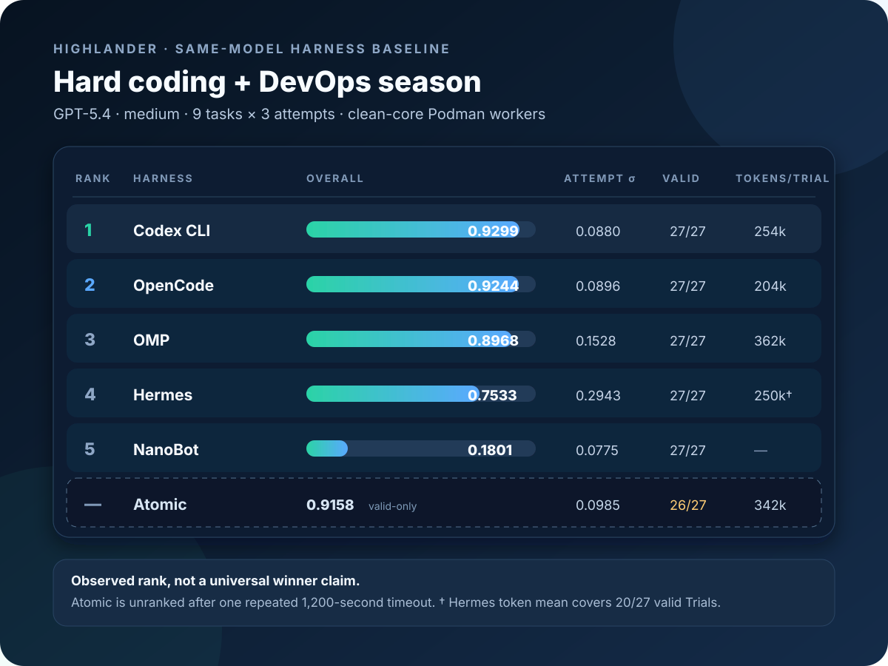

# Highlander

[](https://github.com/T-Py-T/Highlander/actions/workflows/checks.yml)

**A reproducible gauntlet for comparing AI coding-agent harnesses under controlled models, tasks, and evaluators.**

Hand several coding agents the same model, the same repository, the same task, and the same time budget, and they still don't produce the same work. What's left over is the harness: its tools, memory, permissions, subagents, prompt handling, and how it recovers when something goes wrong. Highlander is built to measure that difference instead of guessing at it.

A match freezes the model and everything else that could explain a result, runs each contender in its own disposable environment, scores the resulting repository with a deterministic evaluator, and keeps the transcript, tool ledger, diff, tests, and manifests so anyone can check the number against what actually happened.

- [Why this exists](#why-this-exists)
- [How a match works](#how-a-match-works)
- [Getting started](#getting-started)
- [A worked example](#a-worked-example-reproduce-a-published-season)
- [Running real harnesses](#running-real-harnesses)
- [Project status](#project-status)
- [Documentation](#documentation)
- [What a result does not say](#what-a-result-does-not-say)
- [Contributing](#contributing)
- [License](#license)

## Why this exists

Most published agent comparisons change two things at once. A new tool wins, but it was also pointed at a stronger model, or a larger context window, or a different fallback route, and the write-up has no way to separate the two. The score ends up describing a bundle, not a harness.

Highlander treats the model as a control, not a score dimension. Every contender in a primary match uses the same provider, the same exact model identifier, the same reasoning level, the same context and turn limits, and the same forbidden-fallback policy, against the same repository snapshot and the same unmodified task. If a harness cannot route the fixed model, that incompatibility is recorded as a finding and the run moves to a separate subscription-realism lane rather than being quietly ranked alongside the controlled results.

The second half of the idea is that a score is worthless without its receipts. Every trial retains the artifacts needed to re-derive it, and the manifests are self-verifying, so a reader can confirm that a published bundle is the bundle that was produced.

## How a match works

1. A match spec fixes the repository commit, task, evaluator, model controls, limits, and permissions.
2. Highlander prepares an isolated trial workspace for each contender.
3. Every harness receives the identical task packet, byte for byte.
4. Deterministic evaluators score the resulting repository state.
5. Highlander retains the transcript, tool ledger, diff, tests, evaluator output, usage observations, and operator interactions.
6. The leaderboard ranks only valid, comparable trials, and keeps invalid attempts visible rather than dropping them.

Highlander's vocabulary for these pieces — match, trial, contender, control profile, arena, evidence bundle — is defined in [CONTEXT.md](CONTEXT.md), which is worth two minutes before reading a result directory.

## Getting started

You need Python 3.11 or newer and a clone of this repository. That is the whole list: Highlander's planning and inspection paths are standard library only, so there is nothing to install and nothing to configure before the commands below will work.

```sh
git clone https://github.com/T-Py-T/Highlander.git
cd Highlander
```

Check the included fake match. `doctor` is a read-only preflight that reports each adapter's declared capabilities and whether the match is ready to run:

```sh
python3 tools/highlander.py doctor examples/matches/fake-t001.json
```

Then plan it. `run` is a dry run unless you pass `--execute`, so this prints the execution plan without creating worktrees, starting a harness, or making a model call:

```sh
python3 tools/highlander.py run examples/matches/fake-t001.json
```

The plan it prints is the thing a match is actually built from: the resolved base SHA, the task's byte length and SHA-256, the model route and reasoning level, per-trial worktree and evidence paths, and the redacted invocation for each contender. Read it, and you know exactly what a real run would do.

The contenders in `examples/matches/fake-t001.json` are deterministic test doubles rather than real coding agents — one is scripted to succeed, one to fail — so the example is safe to run anywhere and costs nothing. `examples/matches/omp-opencode-low-reasoning.json` shows the same spec shape with two real harnesses and placeholder provider fields.

Other subcommands are `status`, which reads retained match state, and `stop`, which ends an active tmux match session.

If you want to run the full repository gate the way CI does, install `pre-commit` and run it. The nine hooks execute the unit tests, compile the sources, validate the example match, and re-verify all four retained evidence bundles:

```sh
python3 -m venv .venv
. .venv/bin/activate
python3 -m pip install --upgrade pip pre-commit
pre-commit run --all-files --verbose
```

## A worked example: reproduce a published season

The primary published baseline is a season called `hb-devhard-hardcore-v1-gpt-5.4-medium-r1`: GPT-5.4 at medium reasoning, nine unmodified HarnessBench coding and DevOps tasks from [Qihoo360/harness-bench](https://github.com/Qihoo360/harness-bench), six harnesses, three attempts each. Its complete evidence bundle is checked into this repository, so you can verify it without running anything.



| Rank | Harness | Overall outcome | Attempt σ | Valid slots |
|---:|---|---:|---:|---:|
| 1 | Codex CLI 0.147.0 | 0.9299 | 0.0880 | 27/27 |
| 2 | OpenCode 1.18.15 | 0.9244 | 0.0896 | 27/27 |
| 3 | OMP 17.2.10 | 0.8968 | 0.1528 | 27/27 |
| 4 | Hermes 0.20.0 | 0.7533 | 0.2943 | 27/27 |
| 5 | NanoBot 0.1.5.post3 | 0.1801 | 0.0775 | 27/27 |
| — | Atomic 0.9.15 | 0.9158 valid-only | 0.0985 | 26/27; unranked |

Codex CLI's 0.0055 lead over OpenCode is smaller than either harness's run-to-run dispersion. That is not a tiebreak; it means these two are indistinguishable at this sample size, and the table should be read as a version-bound observation rather than a verdict. Atomic retained one timeout, so it is shown with its valid-only score and no rank.

First, check that the bundle on disk is intact. This walks the manifest and hashes all 6,090 retained artifacts:

```sh
python3 tools/hb-evidence.py verify-season results/hb-devhard-hardcore-v1-gpt-5.4-medium-r1
```

```json
{
  "artifact_count": 6090,
  "bundle": "<your-clone>/results/hb-devhard-hardcore-v1-gpt-5.4-medium-r1",
  "manifest_sha256": "a77fb20926e1134fa3d54167bb8630c1516c2a6c2d4599e3ab6c8787f7b3c1eb",
  "season_status": "provisional",
  "status": "verified"
}
```

Then rebuild the leaderboard yourself from the retained per-trial rows, rather than trusting the published table:

```sh
cd results/hb-devhard-hardcore-v1-gpt-5.4-medium-r1
python3 ../../tools/hb-leaderboard.py \
  --manifest season-manifest.json \
  --results results.jsonl \
  --format markdown
```

The output matches the committed [`leaderboard.md`](results/hb-devhard-hardcore-v1-gpt-5.4-medium-r1/leaderboard.md) line for line, including per-task means, attempt ranges, and invalid counts.

From there you can go down to a single attempt. Each directory under `trials/` holds that attempt's `diff.patch`, `result.json`, normalized usage, cleanup proof, the harness's own `native/` transcript and `tool-ledger.jsonl`, the control proof that the requested model was the model on the wire, and the final workspace. If you disagree with a score, the material to argue with is right there.

Three more bundles are published the same way. `results/hb-devhard-hardcore-v1-gpt-5.6-luna-medium-r4` is the GPT-5.6 stratum, run on the same task matrix and deliberately *not* pooled with GPT-5.4 — the ordering is different, which is the point. `results/hb-devhard-043-gpt54-medium-host4-r1` is an earlier single-task pilot, and `results/fake-t002-protocol-r1` is a model-free protocol bundle that exists to exercise the evidence format itself. [`results/README.md`](results/README.md) explains what each one does and does not establish.

## Running real harnesses

Everything above runs on a laptop with no credentials. Executing actual coding agents does not, and the requirements are deliberately heavy:

- **A container runtime.** Real trials run in a disposable OCI clean room: immutable images, read-only container root, dropped capabilities, an independent clone with `origin` removed, a fresh home directory, and no host credentials or configuration mounted. You build the images locally with `python3 tools/clean-room.py --runtime podman build` (Docker works too).
- **Your own provider credentials and cost approval.** Highlander brokers an authentication-only seed into each trial; it does not ship or proxy any account. Real runs make paid model calls, and `--execute` is required before a single one happens.
- **Patience with the gates.** A run that changes the model, tier, context budget, or fallback route is not a harness result, and the runner is built to refuse it rather than publish it.

[docs/CLEAN-ROOM.md](docs/CLEAN-ROOM.md) documents the full setup, including how each harness image is pinned and checksum-verified, and [docs/SEASON-RUNBOOK.md](docs/SEASON-RUNBOOK.md) covers qualification, execution, export, and verification for a complete season.

## Project status

Highlander is early and run by a single maintainer. Being specific about that:

- There is **no hosted demo and no web leaderboard**. The results in this repository are read as files, and the screenshot above is a static SVG committed to `docs/assets/`.
- There are **no published external users** of the project, and no published third-party reproduction of a season.
- Both published seasons are marked **provisional**. Their process and combined scores are null because no process judge has run, and native token and cost accounting is incomplete wherever providers do not expose comparable fields.
- Every published run so far was produced by the maintainer. The real-harness path has not been reported working on anyone else's machine, so if you try it and it breaks, that is useful information — please open an issue.

[docs/OPEN_PROBLEMS.md](docs/OPEN_PROBLEMS.md) is a longer and blunter version of this list.

## Documentation

| Document | What it covers |
|---|---|
| [CONTEXT.md](CONTEXT.md) | The vocabulary: match, trial, contender, control profile, arena, evidence bundle |
| [Gauntlet design](docs/GAUNTLET.md) | Comparison rules, match lanes, hard gates, and the scoring model |
| [Match runner](docs/MATCH-RUNNER.md) | CLI, state machine, adapters, and the tmux workflow |
| [Clean-room execution](docs/CLEAN-ROOM.md) | Disposable images, isolated homes, authentication seeds, and cleanup |
| [Leaderboard contract](docs/LEADERBOARD.md) | Ranking, reliability, and how invalid runs are handled |
| [Season runbook](docs/SEASON-RUNBOOK.md) | Qualification, execution, export, and verification |
| [Evidence contract](docs/EVIDENCE.md) | Public bundles, redaction, and manifest verification |
| [Open problems](docs/OPEN_PROBLEMS.md) | Unresolved scope, execution, evidence, and stewardship questions |
| [Decision records](docs/adr/README.md) | Why the model is the control, why the match engine is filesystem-backed |
| [Mobile supervision](docs/MOBILE-SUPERVISION.md) | Observe-and-respond experiments |
| [Security policy](SECURITY.md) | Reporting vulnerabilities, and what must never enter retained evidence |

## What a result does not say

- A result applies to the named harness versions, model route, task pack, controls, and run period. It is not a claim about a harness in general or about its next release.
- Native token and cost figures are not comparable across all harnesses, because providers expose different accounting data. Missing figures stay missing rather than being estimated.
- HarnessBench inputs, provider software, and captured third-party output keep their original licenses and terms.
- Personal plugins, extensions, rules, memory, MCP servers, and operator steering are excluded from the primary controlled lane, so a result does not describe a harness as you have configured it.
- Desktop applications are out of scope; the primary lane requires a usable CLI.

## Contributing

Issues and pull requests are welcome. [CONTRIBUTING.md](CONTRIBUTING.md) covers local setup, the pre-commit gate to run before opening a PR, and the evidence boundaries — the short version is to keep changes small, report the commands you actually ran, and leave invalid or blocked outcomes visible instead of tidying them away. [CODE_OF_CONDUCT.md](CODE_OF_CONDUCT.md) applies to everyone taking part, and [SUPPORT.md](SUPPORT.md) is the place to start for questions.

## License

Original Highlander code, tests, schemas, and documentation are released under the [MIT License](LICENSE). Third-party inputs and captured harness output remain under their original terms; see [THIRD_PARTY_NOTICES.md](THIRD_PARTY_NOTICES.md) and [NOTICE.md](NOTICE.md).
